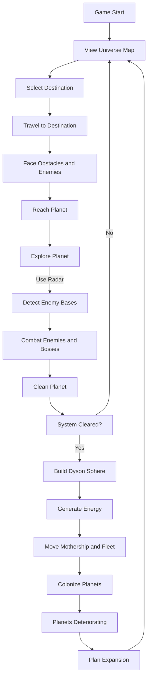
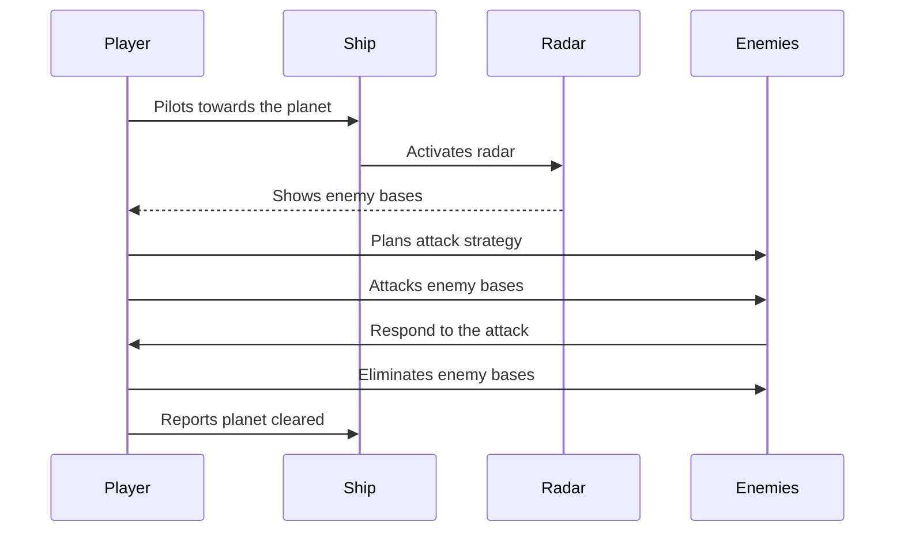

traducción:

# System Requirements Specification Document

## Overview

### General Description

**Galactyx** is a 2D space exploration game with a pixel art style. The game focuses on the exploration of galaxies and exoplanets, where the player takes on the role of a pilot tasked with clearing planets and territories of threats to protect the human mothership. Humanity, after devastating Earth, is looking for new planets to colonize. The player must eliminate enemy bases and build Dyson spheres to generate energy and allow the mothership and its fleet to move to new galaxies. However, by covering the light of stars with these spheres, colonized planets slowly begin to die, creating a perpetual need for expansion.

### Users

- **Players**: People interested in space exploration, strategy, and pixel art-style games.

## Functional Requirements

### rq01 - Explore the Universe Map

| Description              | The game must allow the player to explore a universe map displaying galaxies, solar systems, stars, and planets.             |
| ------------------------ | -------------------------------------------------------------------------------------------------------------------------- |
| Remarks                  | The map must show colonization progress, constructed Dyson spheres, and unlockable planets and galaxies.                    |
| Priority                 | High                                                                                                                       |
| Stability                | Stable                                                                                                                     |
| Associated User Type     | Player                                                                                                                     |
| Actors                   | Player                                                                                                                     |
| Preconditions            | The player has started the game and is on the mothership.                                                                  |
| Postconditions           | The player can view and select destinations on the universe map.                                                           |
| Basic Flow               | 1. The player accesses the universe map. 2. Explores galaxies and solar systems. 3. Selects a destination.           |
| Exceptions               | 1. Locked destinations until certain requirements are met. 2. Errors loading the map.                                   |

### rq02 - Pilot the Ship to Selected Destinations

| Description          | The player must be able to pilot their ship to the selected destination, guided by an on-screen cursor and radar.               |
| -------------------- | ---------------------------------------------------------------------------------------------------------------------------- |
| Remarks              | During the journey, obstacles and enemies may appear that the player must face or avoid. The ship has a radar to detect threats. |
| Priority             | High                                                                                                                         |
| Stability            | Stable                                                                                                                       |
| Associated User Type | Player                                                                                                                       |
| Actors               | Player, Ship                                                                                                                 |
| Preconditions        | The player has selected a destination on the universe map.                                                                   |
| Postconditions       | The player arrives at the destination or is defeated during the journey.                                                     |
| Basic Flow           | 1. The player begins the journey to the destination. 2. Pilots the ship, using the radar to detect obstacles. 3. Faces or avoids threats. 4. Reaches the destination. |
| Exceptions           | 1. The ship is destroyed. 2. Insufficient energy to continue the journey.                                                 |

### rq03 - Explore Planets from an Aerial View

| Description          | Upon arriving at a planet, the player can explore it from an aerial view to locate and eliminate enemy bases.                  |
| -------------------- | ---------------------------------------------------------------------------------------------------------------------------- |
| Remarks              | The player uses their radar to locate enemy bases and plan strategies to eliminate them.                                       |
| Priority             | High                                                                                                                         |
| Stability            | Stable                                                                                                                       |
| Associated User Type | Player                                                                                                                       |
| Actors               | Player, Enemies                                                                                                              |
| Preconditions        | The player has reached a habitable planet.                                                                                    |
| Postconditions       | Enemy bases are eliminated, and the planet is considered partially cleared.                                                   |
| Basic Flow           | 1. The player explores the planet from an aerial view. 2. Uses the radar to locate enemy bases. 3. Plans and executes the elimination of bases. |
| Exceptions           | 1. The player is defeated by enemies. 2. Radar or navigation failures.                                                     |

### rq04 - Build Dyson Spheres after Clearing Solar Systems

| Description          | Once the player has cleared a solar system, a Dyson sphere is built around its star.                                           |
| -------------------- | ---------------------------------------------------------------------------------------------------------------------------- |
| Remarks              | Dyson spheres generate the energy needed for the mothership and its fleet to move forward in the game.                         |
| Priority             | Medium                                                                                                                       |
| Stability            | Stable                                                                                                                       |
| Associated User Type | Player                                                                                                                       |
| Actors               | Player, Construction System                                                                                                  |
| Preconditions        | The player has completely cleared a solar system.                                                                             |
| Postconditions       | A Dyson sphere is built, and energy is accumulated to progress in the game.                                                   |
| Basic Flow           | 1. The player completes the clearing of the solar system. 2. Initiates the construction of the Dyson sphere. 3. The sphere is built and begins generating energy. |
| Exceptions           | 1. Insufficient resources for construction. 2. Enemy interference during construction.                                     |

### rq05 - Face Enemies

| Description              | The player must face enemies of different sizes, including bosses, to clear planets and systems.                           |
| ------------------------ | ------------------------------------------------------------------------------------------------------------------------ |
| Remarks                  | Enemies present different difficulty levels and require specific strategies to be defeated. The player's radar is key for detecting threats. |
| Priority                 | High                                                                                                                     |
| Stability                | Stable                                                                                                                   |
| Associated User Type     | Player                                                                                                                   |
| Actors                   | Player, Enemies, Bosses                                                                                                  |
| Preconditions            | The player is exploring a planet or solar system.                                                                        |
| Postconditions           | Enemies are defeated, allowing the player to progress.                                                                   |
| Basic Flow               | 1. The player encounters enemies during exploration. 2. Uses the radar and plans their strategy. 3. Fights and defeats the enemies and bosses. |
| Exceptions               | 1. The player is defeated. 2. Enemies flee or receive reinforcements.                                                 |

### rq06 - Manage Resources and Energy

| Description          | The player must search for and collect resources to maintain their ship and build Dyson spheres.                                |
| -------------------- | ---------------------------------------------------------------------------------------------------------------------------- |
| Remarks              | Energy is needed to make hyperspace jumps and recharge using the ship's solar panels.                                          |
| Priority             | Medium                                                                                                                       |
| Stability            | Stable                                                                                                                       |
| Associated User Type | Player                                                                                                                       |
| Actors               | Player, Resource System                                                                                                      |
| Preconditions        | The player is exploring or traveling.                                                                                        |
| Postconditions       | Resources are collected and used efficiently.                                                                                |
| Basic Flow           | 1. The player identifies resource sources. 2. Collects the necessary resources. 3. Manages resources to maintain the ship and build Dyson spheres. |
| Exceptions           | 1. Resources depleted. 2. Loss of resources due to enemy attacks.                                                         |

### rq07 - Navigate Obstacles and Face Random Events

| Description          | During journeys, the player will encounter obstacles such as asteroids, pirates, and dwarf planets with raiders that must be faced or avoided. |
| -------------------- | ---------------------------------------------------------------------------------------------------------------------------- |
| Remarks              | These events add challenge and variety to the game, requiring quick decisions and strategies. The ship has a radar to detect these events. |
| Priority             | Medium                                                                                                                       |
| Stability            | Stable                                                                                                                       |
| Associated User Type | Player                                                                                                                       |
| Actors               | Player, Obstacles, Random Enemies                                                                                            |
| Preconditions        | The player is traveling to a destination.                                                                                     |
| Postconditions       | The player overcomes obstacles and continues their journey.                                                                   |
| Basic Flow           | 1. The player begins the journey. 2. Encounters obstacles or enemies detected by the radar. 3. Decides whether to face or avoid them. 4. Overcomes the event and proceeds. |
| Exceptions           | 1. The ship is damaged or destroyed. 2. The player is diverted from their route.                                           |

### rq08 - Move the Mothership and Colonize New Planets

| Description          | By building enough Dyson spheres, the energy required to move the mothership and its fleet to the current galaxy is generated, enabling colonization. |
| -------------------- | ---------------------------------------------------------------------------------------------------------------------------- |
| Remarks              | Colonizing new planets is essential to game progression and presents new challenges.                                           |
| Priority             | Medium                                                                                                                       |
| Stability            | Stable                                                                                                                       |
| Associated User Type | Player                                                                                                                       |
| Actors               | Player, Mothership, Colonization System                                                                                       |
| Preconditions        | Enough Dyson spheres have been built.                                                                                         |
| Postconditions       | The mothership moves to the new galaxy, and planets are colonized.                                                            |
| Basic Flow           | 1. The player accumulates the necessary energy. 2. Initiates the movement of the mothership. 3. The planets are colonized and fully cleared. |
| Exceptions           | 1. Portal failure to move the mothership. 2. New threats on the colonized planets.                                         |

### rq09 - Manage Energy and Expansion Cycle

| Description          | By covering the stars' light with Dyson spheres, colonized planets begin to die, creating a perpetual need for expansion.        |
| -------------------- | ---------------------------------------------------------------------------------------------------------------------------- |
| Remarks              | This introduces a strategic element where the player must balance energy generation with the health of the colonized planets.   |
| Priority             | Medium                                                                                                                       |
| Stability            | Stable                                                                                                                       |
| Associated User Type | Player                                                                                                                       |
| Actors               | Player, Energy Management and Colonization System                                                                             |
| Preconditions        | The player has colonized planets and built Dyson spheres.                                                                     |
| Postconditions       | The player must plan continuous expansion to avoid the death of colonized planets.                                            |
| Basic Flow           | 1. The player observes the deterioration of colonized planets. 2. Plans expansion to new systems. 3. Continues the exploration and colonization cycle. |
| Exceptions           | 1. Ecological collapse of colonized planets. 2. Lack of resources to continue expanding.                                   |

## Non-functional Requirements

### rq10 - Expandability

| Description          | The game's design must allow for future expansions and updates, facilitating the addition of new content and features.          |
| -------------------- | ---------------------------------------------------------------------------------------------------------------------------- |
| Remarks              | A modular and well-documented codebase is essential to facilitate the game's maintenance and evolution.                        |
| Priority             | Medium                                                                                                                       |
| Stability            | Stable                                                                                                                       |
| Associated User Type | Developer                                                                                                                     |

## System Constraints

### General Constraints

- **Supported Platforms**: The game must run on Windows operating systems.
- **Minimum Hardware**: The game must run on low-resource machines, optimizing CPU and memory usage.

## Game Progress Flowchart

## Sequence Diagram for Planet Exploration

